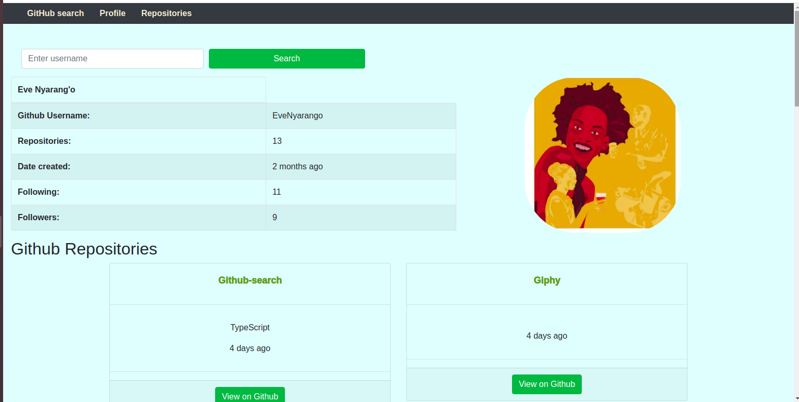

# Github

This project was generated with [Angular CLI](https://github.com/angular/angular-cli) version 10.2.0.

## Author
Eve Nyarang'o

## Description
This website enables the user to search for their github profile and their repositories that links their github projects.

## Project image

## BDD
Enter Github user name.

## Development server

Run `ng serve` for a dev server. Navigate to `http://localhost:4200/`. The app will automatically reload if you change any of the source files.

## Installation Requirement

Run `ng generate component component-name` to generate a new component. You can also use `ng generate directive|pipe|service|class|guard|interface|enum|module`.

## Build

Run `ng build` to build the project. The build artifacts will be stored in the `dist/` directory. Use the `--prod` flag for a production build.

## Technologies used
This page was created using HTML, Angular CLI, BOOTSTRAP and CSS.

## Link
https://github.com/EveNyarango/Github-search

## Running unit tests

Run `ng test` to execute the unit tests via [Karma](https://karma-runner.github.io).

## Contact Information
 Email; evenyarango@gmail.com

 ## License and copyright
 MIT 

Copyright (C) **{Eve Nyarang'o}

## Further help

To get more help on the Angular CLI use `ng help` or go check out the [Angular CLI Overview and Command Reference](https://angular.io/cli) page.
